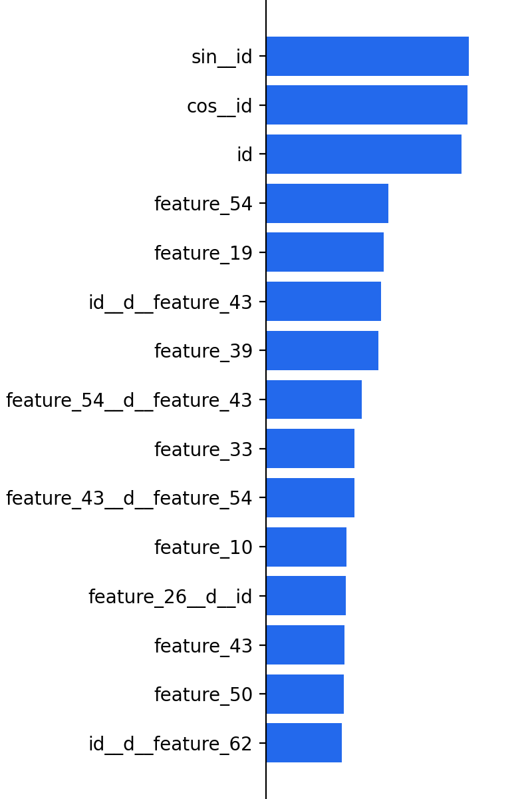

# Amplo AutoML Documentation - LGBMClassifier v1

## Model Information

LightGBM, or **L**ight **G**radient **B**oosting **M**achine, is an iteration on the XGBoost algorithm. Similarly, it uses gradient boosting with decision trees. However, XGBoost tend to be slow for a larger number of samples (>10.000), but with leaf-wise growth instead of depth-wise growth, LightGBM increases training speed significatnly. Performance is often close to XGBoost, sometimes for the better and sometimes for the worse. 

## Model Performance

Model performance is analysed by various metrics. Below you find various metrics and a confusion matrix.
This model has been selected based on the neg_log_loss score.

### Metrics

| Metrcis | Score |
| --- | ---: |
| Avg. Accuracy | 0.31 ± 0.00 |
| F1 Score      | 0.09 ± 0.17 |
| Log Loss      | 1.87 ± 0.00 |

### Confusion Matrix

<table>
    <thead>
        <tr>
            <td> </td>
            <td> </td>
            <td colspan=9 style="text-align:center">True Label</td>
        </tr>
        <tr><td> </td><td> </td><td> 6.0 </td><td> 2.0 </td><td> 8.0 </td><td> 3.0 </td><td> 1.0 </td><td> 5.0 </td><td> 7.0 </td><td> 0.0 </td><td> 4.0 </td></tr>
    </thead>
    <tbody>
        <tr>
<td rowspan=9 style="vertical-align:middle">Prediction</td>
<td>
6.0
</td>
<td>
0.00 ± 0.00
</td>
<td>
0.00 ± 0.00
</td>
<td>
0.00 ± 0.00
</td>
<td>
0.00 ± 0.00
</td>
<td>
0.00 ± 0.00
</td>
<td>
0.00 ± 0.00
</td>
<td>
5.83 ± 0.18
</td>
<td>
0.00 ± 0.00
</td>
<td>
6.94 ± 0.18
</td>
</tr>
<tr>

<td>
2.0
</td>
<td>
0.00 ± 0.00
</td>
<td>
0.00 ± 0.00
</td>
<td>
0.00 ± 0.00
</td>
<td>
0.00 ± 0.00
</td>
<td>
0.00 ± 0.00
</td>
<td>
0.00 ± 0.00
</td>
<td>
2.10 ± 0.08
</td>
<td>
0.00 ± 0.00
</td>
<td>
2.46 ± 0.08
</td>
</tr>
<tr>

<td>
8.0
</td>
<td>
0.00 ± 0.00
</td>
<td>
0.00 ± 0.00
</td>
<td>
0.00 ± 0.00
</td>
<td>
0.00 ± 0.00
</td>
<td>
0.00 ± 0.00
</td>
<td>
0.00 ± 0.00
</td>
<td>
6.67 ± 0.25
</td>
<td>
0.00 ± 0.00
</td>
<td>
5.55 ± 0.25
</td>
</tr>
<tr>

<td>
3.0
</td>
<td>
0.00 ± 0.00
</td>
<td>
0.00 ± 0.00
</td>
<td>
0.00 ± 0.00
</td>
<td>
0.00 ± 0.00
</td>
<td>
0.00 ± 0.00
</td>
<td>
0.00 ± 0.00
</td>
<td>
3.73 ± 0.15
</td>
<td>
0.00 ± 0.00
</td>
<td>
3.67 ± 0.15
</td>
</tr>
<tr>

<td>
1.0
</td>
<td>
0.00 ± 0.00
</td>
<td>
0.00 ± 0.00
</td>
<td>
0.00 ± 0.00
</td>
<td>
0.00 ± 0.00
</td>
<td>
0.00 ± 0.00
</td>
<td>
0.00 ± 0.00
</td>
<td>
1.08 ± 0.02
</td>
<td>
0.00 ± 0.00
</td>
<td>
1.27 ± 0.02
</td>
</tr>
<tr>

<td>
5.0
</td>
<td>
0.00 ± 0.00
</td>
<td>
0.00 ± 0.00
</td>
<td>
0.00 ± 0.00
</td>
<td>
0.00 ± 0.00
</td>
<td>
0.00 ± 0.00
</td>
<td>
0.00 ± 0.00
</td>
<td>
0.66 ± 0.02
</td>
<td>
0.00 ± 0.00
</td>
<td>
0.87 ± 0.02
</td>
</tr>
<tr>

<td>
7.0
</td>
<td>
0.00 ± 0.00
</td>
<td>
0.00 ± 0.00
</td>
<td>
0.00 ± 0.00
</td>
<td>
0.00 ± 0.00
</td>
<td>
0.00 ± 0.00
</td>
<td>
0.00 ± 0.00
</td>
<td>
15.22 ± 0.13
</td>
<td>
0.00 ± 0.00
</td>
<td>
10.68 ± 0.13
</td>
</tr>
<tr>

<td>
0.0
</td>
<td>
0.00 ± 0.00
</td>
<td>
0.00 ± 0.00
</td>
<td>
0.00 ± 0.00
</td>
<td>
0.00 ± 0.00
</td>
<td>
0.00 ± 0.00
</td>
<td>
0.00 ± 0.00
</td>
<td>
2.85 ± 0.02
</td>
<td>
0.00 ± 0.00
</td>
<td>
4.54 ± 0.02
</td>
</tr>
<tr>

<td>
4.0
</td>
<td>
0.00 ± 0.00
</td>
<td>
0.00 ± 0.00
</td>
<td>
0.00 ± 0.00
</td>
<td>
0.00 ± 0.00
</td>
<td>
0.00 ± 0.00
</td>
<td>
0.00 ± 0.00
</td>
<td>
9.95 ± 0.10
</td>
<td>
0.00 ± 0.00
</td>
<td>
15.94 ± 0.10
</td>
</tr>
    </tbody>
</table>
                

## Validation Strategy

All experiments are cross validated. This means that every time a model's performance is evaluated, it's trained on one part of the data, and tested on another. Therefore, the model is always tested against data it has not yet been trained for. This gives the best approximation for real world (out of sample) performance.
The current validation strategy used StratifiedKFold, with 3 splits and with shuffling the data.

## Parameters

The optimized model has the following parameters:

| num_iterations | metric | lambda_l1 | lambda_l2 | num_leaves | feature_fraction | bagging_fraction | bagging_freq | min_data_in_leaf | objective|
| --- | --- | --- | --- | --- | --- | --- | --- | --- | --- |
| 305 | auc_mu | 0.1302 | 0.0007 | 195 | 0.6022 | 0.6299 | 3 | 113 | multiclass |

| num_classes|
| --- |
| 9 |

## Features

### Feature Extraction

Firstly, features that are co-linear (a * x = y), up to 99.0 %, were removed. This resulted in 0 removed features:
 

Subsequently, the features were manipulated and analysed to extract additional information. 
Most combinations are tried (early stopping avoids unpromising features directly). 
The usefulness of a newly extracted features are analysed by a single decision tree. 

| Sort Feature | Quantity | Features |
| --- | ---: | --- |
| Multiplied / Divided Features | 412 | id__d__feature_23, id__d__feature_66, id__d__feature_43, id__d__feature_31, id__d__feature_13, id__d__feature_62, id__d__feature_45, id__d__feature_70, id__d__feature_61, feature_0__d__feature_28, feature_0__d__feature_73, feature_1__d__feature_11, feature_1__d__feature_61, feature_2__d__feature_29, feature_2__d__feature_15, feature_3__d__feature_15, feature_3__d__feature_59, feature_4__d__feature_27, feature_4__d__feature_60, feature_4__d__id, feature_5__x__feature_17, feature_5__x__feature_31, feature_5__d__feature_26, feature_6__x__feature_66, feature_6__d__feature_49, feature_7__x__feature_49, feature_7__x__feature_32, feature_7__d__feature_19, feature_7__d__feature_29, feature_7__d__feature_61, feature_7__d__feature_63, feature_8__d__feature_28, feature_9__d__feature_29, feature_9__d__feature_48, feature_10__x__feature_17, feature_11__x__feature_60, feature_11__x__feature_69, feature_11__x__feature_49, feature_11__d__feature_62, feature_11__d__feature_61, feature_11__d__feature_71, feature_11__d__feature_14, feature_11__d__feature_34, feature_12__d__feature_29, feature_12__d__feature_59, feature_12__d__feature_60, feature_12__d__feature_46, feature_12__d__feature_61, feature_12__d__feature_74, feature_12__d__feature_17, feature_12__d__feature_28, feature_12__d__feature_57, feature_12__d__feature_35, feature_12__d__feature_56, feature_12__d__feature_26, feature_13__d__feature_52, feature_13__d__feature_66, feature_13__d__feature_73, feature_14__x__feature_30, feature_14__d__feature_28, feature_15__x__feature_22, feature_15__x__feature_17, feature_15__d__feature_44, feature_15__d__feature_47, feature_15__d__feature_31, feature_15__d__feature_25, feature_15__d__feature_66, feature_15__d__feature_56, feature_17__x__feature_24, feature_17__x__feature_16, feature_17__x__feature_58, feature_17__x__feature_29, feature_17__x__feature_6, feature_17__x__feature_25, feature_17__x__feature_56, feature_17__x__feature_47, feature_17__x__feature_74, feature_17__x__feature_7, feature_17__x__feature_38, feature_17__d__feature_51, feature_17__d__feature_27, feature_18__x__feature_0, feature_18__d__feature_32, feature_18__d__feature_61, feature_18__d__feature_31, feature_19__d__feature_73, feature_19__d__feature_7, feature_20__d__feature_46, feature_20__d__feature_49, feature_20__d__feature_60, feature_20__d__feature_73, feature_21__d__feature_29, feature_21__d__feature_1, feature_21__d__feature_3, feature_21__d__feature_59, feature_22__d__feature_31, feature_22__x__feature_4, feature_22__d__feature_58, feature_22__x__feature_36, feature_22__x__feature_71, feature_22__d__feature_55, feature_22__x__feature_17, feature_22__d__feature_40, feature_22__d__feature_61, feature_22__d__feature_18, feature_22__d__feature_60, feature_22__d__feature_5, feature_22__d__feature_63, feature_23__d__feature_47, feature_23__x__feature_71, feature_23__x__feature_17, feature_23__d__feature_24, feature_23__d__feature_60, feature_23__d__feature_63, feature_24__x__feature_49, feature_24__d__feature_61, feature_24__d__feature_44, feature_24__d__feature_71, feature_25__x__feature_17, feature_25__x__feature_49, feature_25__d__feature_5, feature_25__d__feature_15, feature_26__d__feature_63, feature_26__x__feature_49, feature_26__x__feature_45, feature_26__d__id, feature_26__d__feature_30, feature_27__d__feature_66, feature_27__d__feature_30, feature_28__d__feature_61, feature_29__d__feature_38, feature_29__x__feature_23, feature_29__d__feature_62, feature_29__d__feature_9, feature_29__d__feature_59, feature_29__d__feature_47, feature_29__d__feature_7, feature_29__d__feature_69, feature_29__d__feature_66, feature_30__x__feature_42, feature_30__d__feature_53, feature_31__d__feature_18, feature_31__d__feature_15, feature_31__d__feature_42, feature_31__d__feature_41, feature_32__x__id, feature_32__d__feature_18, feature_32__d__feature_73, feature_32__d__feature_43, feature_33__x__feature_49, feature_33__x__feature_17, feature_34__d__feature_35, feature_34__d__feature_66, feature_35__x__feature_0, feature_35__d__feature_56, feature_35__d__feature_15, feature_35__d__feature_37, feature_35__d__feature_21, feature_35__d__feature_44, feature_35__d__feature_24, feature_36__x__feature_17, feature_36__x__feature_49, feature_36__x__feature_66, feature_36__x__feature_21, feature_37__x__id, feature_37__d__feature_15, feature_37__d__feature_35, feature_37__d__feature_61, feature_38__d__feature_46, feature_38__d__feature_31, feature_38__x__feature_22, feature_38__d__feature_15, feature_38__x__feature_71, feature_40__x__feature_68, feature_41__x__feature_60, feature_41__d__feature_30, feature_41__d__feature_21, feature_42__d__feature_44, feature_42__d__feature_63, feature_42__d__feature_31, feature_42__d__feature_73, feature_43__d__feature_73, feature_43__d__feature_28, feature_43__d__feature_54, feature_43__d__feature_59, feature_43__d__feature_57, feature_43__d__feature_32, feature_43__d__feature_53, feature_44__x__feature_49, feature_44__d__feature_61, feature_44__d__feature_42, feature_45__d__feature_69, feature_45__x__feature_26, feature_45__x__feature_22, feature_45__x__feature_17, feature_46__x__feature_49, feature_46__x__feature_23, feature_46__x__feature_22, feature_46__d__feature_60, feature_46__x__feature_10, feature_46__d__feature_69, feature_46__d__feature_63, feature_46__x__id, feature_46__d__feature_37, feature_46__d__feature_73, feature_47__x__feature_21, feature_47__x__feature_65, feature_47__x__feature_49, feature_47__x__feature_6, feature_47__x__feature_74, feature_47__d__feature_22, feature_47__x__feature_46, feature_47__x__feature_1, feature_47__d__feature_29, feature_47__x__feature_63, feature_47__x__feature_17, feature_47__d__feature_73, feature_48__d__feature_46, feature_48__x__feature_71, feature_48__d__feature_60, feature_49__x__feature_15, feature_49__x__feature_63, feature_49__d__feature_60, feature_49__x__feature_61, feature_49__x__feature_73, feature_49__d__feature_46, feature_49__x__feature_46, feature_49__d__feature_6, feature_49__x__feature_6, feature_49__x__feature_59, feature_49__x__feature_26, feature_49__x__feature_33, feature_49__x__feature_24, feature_49__x__feature_4, feature_49__x__feature_7, feature_49__x__feature_66, feature_49__x__feature_67, feature_49__x__feature_27, feature_49__x__feature_34, feature_49__x__feature_13, feature_49__x__feature_23, feature_49__x__feature_70, feature_49__x__feature_57, feature_49__x__feature_10, feature_49__x__feature_44, feature_49__x__feature_74, feature_49__d__id, feature_49__d__feature_39, feature_50__x__feature_15, feature_51__d__feature_15, feature_51__x__feature_74, feature_51__x__feature_17, feature_51__x__feature_49, feature_51__d__feature_69, feature_52__x__feature_73, feature_52__d__feature_15, feature_52__x__feature_17, feature_52__d__feature_13, feature_53__x__id, feature_53__d__feature_30, feature_54__d__feature_43, feature_55__x__id, feature_56__d__feature_15, feature_56__d__feature_29, feature_56__d__feature_28, feature_56__d__feature_22, feature_57__d__feature_69, feature_57__d__feature_27, feature_57__d__feature_43, feature_57__x__feature_49, feature_58__d__feature_32, feature_58__d__feature_61, feature_58__x__feature_17, feature_58__x__feature_49, feature_58__d__feature_28, feature_58__d__feature_54, feature_59__d__feature_3, feature_59__d__feature_41, feature_59__x__feature_17, feature_59__d__feature_29, feature_59__x__feature_4, feature_59__d__feature_2, feature_59__d__feature_43, feature_59__x__feature_32, feature_59__d__feature_71, feature_59__x__feature_71, feature_59__x__feature_69, feature_59__d__feature_16, feature_59__x__feature_23, feature_59__x__id, feature_59__d__feature_47, feature_59__x__feature_47, feature_59__x__feature_49, feature_59__x__feature_66, feature_59__d__feature_52, feature_59__x__feature_36, feature_59__x__feature_26, feature_59__d__feature_1, feature_59__d__feature_73, feature_59__d__feature_53, feature_59__d__feature_45, feature_59__d__feature_31, feature_59__d__feature_50, feature_59__d__feature_13, feature_59__d__feature_61, feature_60__d__feature_20, feature_60__x__feature_66, feature_60__d__feature_74, feature_60__x__feature_74, feature_60__d__feature_3, feature_60__d__feature_0, feature_60__x__feature_0, feature_60__x__feature_41, feature_60__x__feature_17, feature_60__d__feature_35, feature_60__x__feature_11, feature_60__d__feature_47, feature_60__d__feature_64, feature_60__x__id, feature_61__d__feature_25, feature_61__x__feature_49, feature_61__d__feature_72, feature_61__d__feature_73, feature_61__d__feature_18, feature_61__d__feature_7, feature_61__d__feature_59, feature_61__d__feature_44, feature_61__d__feature_27, feature_61__d__feature_24, feature_61__d__feature_1, feature_61__d__feature_37, feature_61__d__feature_11, feature_62__x__feature_67, feature_62__d__feature_59, feature_62__x__feature_8, feature_62__x__feature_4, feature_63__d__feature_52, feature_63__d__feature_72, feature_63__d__feature_22, feature_63__d__feature_7, feature_63__x__feature_5, feature_63__x__feature_49, feature_63__d__feature_66, feature_64__x__feature_4, feature_64__x__feature_6, feature_64__x__feature_24, feature_64__x__feature_9, feature_64__x__feature_30, feature_64__x__feature_17, feature_65__x__feature_47, feature_65__x__id, feature_66__d__feature_40, feature_66__d__feature_61, feature_66__x__feature_7, feature_66__d__feature_13, feature_66__x__feature_17, feature_66__x__feature_49, feature_66__x__feature_22, feature_66__x__feature_6, feature_66__x__feature_36, feature_67__x__feature_29, feature_67__d__feature_49, feature_67__x__feature_49, feature_67__d__feature_15, feature_67__x__feature_17, feature_67__x__feature_62, feature_68__x__feature_40, feature_68__d__feature_27, feature_68__x__feature_5, feature_68__x__feature_4, feature_68__d__feature_52, feature_69__d__feature_29, feature_69__d__feature_55, feature_69__x__feature_11, feature_69__x__feature_17, feature_69__d__feature_45, feature_69__d__feature_51, feature_70__x__feature_49, feature_70__d__feature_38, feature_70__d__feature_71, feature_70__x__feature_30, feature_70__d__feature_17, feature_70__x__feature_17, feature_71__d__feature_34, feature_71__x__feature_23, feature_71__x__feature_48, feature_71__x__feature_22, feature_71__d__feature_70, feature_71__x__feature_38, feature_72__d__feature_63, feature_72__x__id, feature_72__d__feature_61, feature_72__x__feature_20, feature_72__d__feature_59, feature_73__x__feature_49, feature_73__d__feature_18, feature_73__x__feature_13, feature_73__x__feature_47, feature_73__d__feature_42, feature_73__d__feature_71, feature_73__x__feature_17, feature_73__d__feature_60, feature_74__x__feature_11, feature_74__x__feature_51, feature_74__x__feature_49, feature_74__d__feature_17, feature_74__x__feature_17, feature_74__d__feature_12, feature_74__x__feature_22, feature_74__x__feature_5, feature_74__x__feature_36, feature_74__d__feature_47 |
| Added / Subtracted Features   | 0 |  |
| Trigonometric Features        | 9 | sin__id, cos__id, sin__feature_1, sin__feature_17, sin__feature_22, sin__feature_49, sin__feature_53, sin__feature_59, sin__feature_74 |
| K-Means Features              | 0 |  |
| Lagged Features               | 0 |  |
| Differentiated Features       | 0 |  |

### Feature Selection
Using a Random Forest model, the non-linear Feature Importance is analysed. The Feature Importance is measured
in Mean Decrease in Gini Impurity. 
The Feature Importance is used to create two feature sets, one that contains 95% of all Feature Importance (RFT) and 
one that contains all features that contribute more than 1% to the total Feature Importance (RFI). 

Top 20 features:

## Data Processing
        
Data cleaning steps: 
1. Removed 0 duplicate columns and 0 duplicate rows.
2. Handled outliers with clip
3. Imputed 0 missing values with interpolate
4. Removed 0 columns with only constant values

## Model Score Board

Not only LGBMClassifier has been optimized by the AutoML pipeline. In total, 290 models were trained. 
The following table shows the performance of the top 10 performing models:

| Model | neg_log_loss     | Parameters |
| --- | ---: | --- |
| CatBoostClassifier | -1.7474 ± 0.0010 | {'n_estimators': 1512, 'learning_rate': 0.015561726174461438, 'l2_leaf_reg': 5.421254944299484, 'depth': 5, 'min_data_in_leaf': 914, 'grow_policy': 'Lossguide'} |
| CatBoostClassifier | -1.7501 ± 0.0007 | {'verbose': 0, 'allow_writing_files': False, 'n_estimators': 1000} |
| HistGradientBoostingClassifier | -1.7562 ± 0.0021 | {'learning_rate': 0.14858839097513943, 'max_iter': 138, 'max_leaf_nodes': 31, 'max_depth': 8, 'min_samples_leaf': 261, 'l2_regularization': 8.675498344925586, 'max_bins': 200} |
| HistGradientBoostingClassifier | -1.7584 ± 0.0013 | {'categorical_features': None, 'early_stopping': 'auto', 'l2_regularization': 0.0, 'learning_rate': 0.1, 'loss': 'auto', 'max_bins': 255, 'max_depth': None, 'max_iter': 100, 'max_leaf_nodes': 31, 'min_samples_leaf': 20, 'monotonic_cst': None, 'n_iter_no_change': 10, 'random_state': None, 'scoring': 'loss', 'tol': 1e-07, 'validation_fraction': 0.1, 'verbose': 0, 'warm_start': False} |
| HistGradientBoostingClassifier | -1.7593 ± 0.0009 | {'learning_rate': 0.002249828539472283, 'max_iter': 862, 'max_leaf_nodes': 128, 'max_depth': 5, 'min_samples_leaf': 501, 'l2_regularization': 5.049858337536902, 'max_bins': 217} |
| LGBMClassifier | -1.7614 ± 0.0003 | {'verbosity': -1, 'force_col_wise': True, 'objective': 'multiclass', 'num_classes': 9} |
| CatBoostClassifier | -1.8517 ± 0.0003 | {'verbose': 0, 'allow_writing_files': False, 'n_estimators': 1000} |
| HistGradientBoostingClassifier | -1.8542 ± 0.0003 | {'categorical_features': None, 'early_stopping': 'auto', 'l2_regularization': 0.0, 'learning_rate': 0.1, 'loss': 'auto', 'max_bins': 255, 'max_depth': None, 'max_iter': 100, 'max_leaf_nodes': 31, 'min_samples_leaf': 20, 'monotonic_cst': None, 'n_iter_no_change': 10, 'random_state': None, 'scoring': 'loss', 'tol': 1e-07, 'validation_fraction': 0.1, 'verbose': 0, 'warm_start': False} |
| LGBMClassifier | -1.8601 ± 0.0002 | {'verbosity': -1, 'force_col_wise': True, 'objective': 'multiclass', 'num_classes': 9} |
| RandomForestClassifier | -2.0170 ± 0.0033 | {'bootstrap': True, 'ccp_alpha': 0.0, 'class_weight': None, 'criterion': 'gini', 'max_depth': None, 'max_features': 'auto', 'max_leaf_nodes': None, 'max_samples': None, 'min_impurity_decrease': 0.0, 'min_impurity_split': None, 'min_samples_leaf': 1, 'min_samples_split': 2, 'min_weight_fraction_leaf': 0.0, 'n_estimators': 100, 'n_jobs': None, 'oob_score': False, 'random_state': None, 'verbose': 0, 'warm_start': False} |

